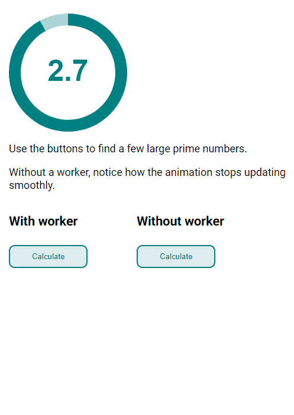

## react-redux-worker

Run a Redux store in a web worker.

### Why

If you're doing any sort of computationally expensive work in your [Redux](https://redux.js.org) reducers or middleware, it
can prevent your UI from responding while it's thinking&mdash;making your application feel slow and
unresponsive.

In theory, web workers should be the perfect solution: You can do your heavy lifting in a worker
thread without interfering with your main UI thread. But the asynchronous, message-based [web worker
API](https://redux.js.org) puts us in unfamiliar terrain.

This library is intended to make the developer experience of using a worker-based Redux store as
similar as possible to an ordinary Redux setup.

### How it works


### Running the demo

```
yarn
yarn demo
```

Then open http://localhost:1234 in a browser. You should see this:



### Usage

### Prior art

Based on [redux-workerized](https://github.com/mizchi/redux-workerized) by [@mizchi](https://github.com/mizchi/)

### License

MIT
