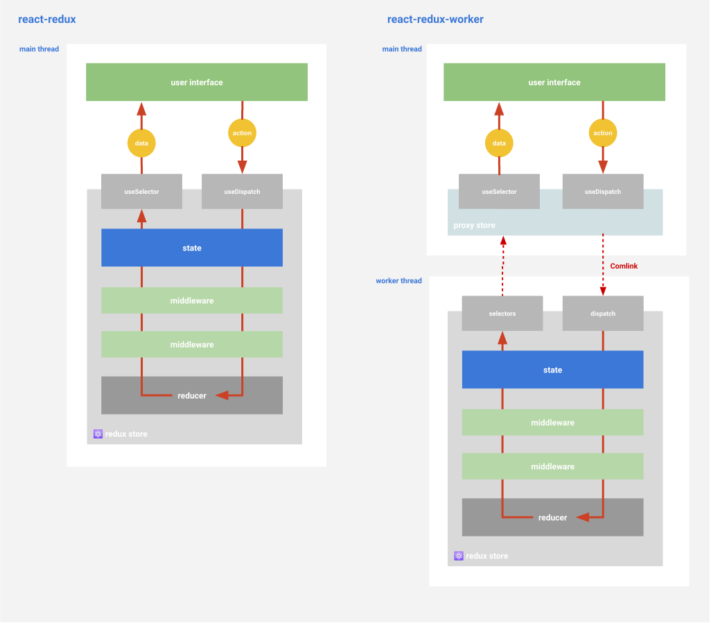
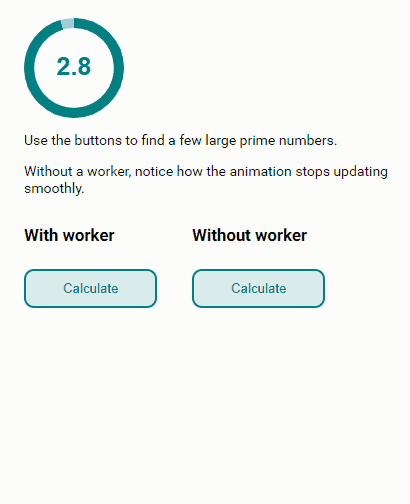

# react-redux-worker

Run a Redux store in a web worker.

## Why?

If you're doing any sort of computationally expensive work in your [Redux](https://redux.js.org) reducers or middleware, it
can prevent your UI from responding while it's thinking&mdash;making your application feel slow and
unresponsive.

In theory, web workers should be the perfect solution: You can do your heavy lifting in a worker
thread without interfering with your main UI thread. But the message-based [web worker
API](https://redux.js.org) puts us in unfamiliar terrain.

This library is intended to make the developer experience of using a worker-based Redux store as
similar as possible to an ordinary Redux setup.

## How it works

This library provides you with a **proxy Redux store**. To your application, the proxy looks just
like the real thing: You communicate with it synchronously using `useDispatch` and `useSelector`
hooks just like the ones that the official [react-redux](https://github.com/reduxjs/react-redux)
bindings provide.



The proxy then handles messaging back and forth with the store in the worker using the
[Comlink](https://github.com/GoogleChromeLabs/comlink) library, built by the Google Chrome team.

## Running the demo

```bash
yarn
yarn start
```

Then open http://localhost:1234 in a browser. You should see something like this:



## Usage

### Add the dependency

```bash
yarn add react-redux-worker
```

### Put your store in a worker, and create a proxy

In a stand-alone file called `worker.ts` or `store.worker.ts`, import your reducer (and middlewares,
if applicable) and build your store the way you always have. Then wrap it in a proxy store,
and expose that as a worker messaging endpoint:

```ts
// worker.ts
import { createStore } from 'redux'
import { reducer } from './reducer'
import { expose, createProxyStore } from 'react-redux-worker'

const store = createStore(reducer) // if you have initial state and/or middleware you can add them here as well
const proxyStore = createProxyStore(store)
expose(proxyStore, self)
```

### Add a context provider for the proxy store

At the root of your app, replace your standard `Provider` with one that gives access to the proxy
store.

```ts
const worker = new Worker('./redux/worker.ts')
const ProxyProvider = await getProvider(worker)


## Prior art

Based on [redux-workerized](https://github.com/mizchi/redux-workerized) by [@mizchi](https://github.com/mizchi/)
```
